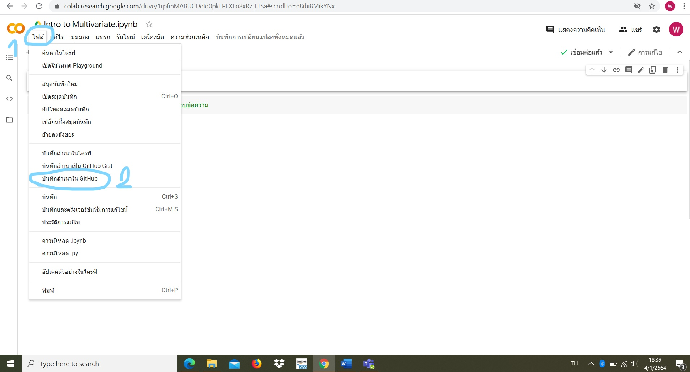
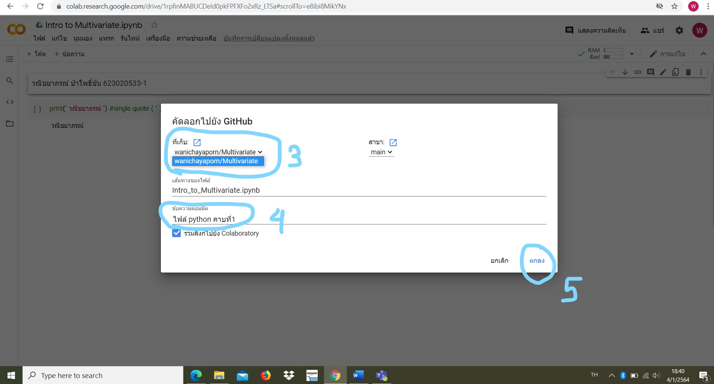

# Multivariate

### วณิชยาภรณ์ ป่าโพธิ์ชัน ID 623020533-1

.md => Markdown

[ ] square brackets

( ) parentheses

อธิบายการใช้งาน Github และ Google Colab ว่าหน้าที่ของเเต่ละอันคืออะไร เเละอธิบายวิธีเซฟไฟล์จาก Google Colab ลงใน Github

1.GitHub คือ website Git (version control repository) ที่อยู่บน internet มีการทำงานแบบเดียวกับ Git เลย แต่สามารถเข้าถึงข้อมูลและจัดการไปผ่าน web โดยไม่ต้องเสียเงิน หรือลงทุกตั้ง server เพื่อติดตั้ง Git เองเลย แต่ code project ทั้งหมดจะถูกแจกจ่ายให้คนอื่นๆสามารถเห็นได้ด้วย

2.Google Colab
	เป็นโปรเจ็คที่พัฒนาโดยทีม Google Research ที่เปิดให้นักศึกษาและคนทั่วไปที่อยากเริ่มเขียนโค้ด Python ใช้งานได้ฟรีผ่าน Google Chrome Browser
การใช้งาน Colab ง่ายมาก แค่พิมพ์โค้ดแล้วกดรันได้เลย เวลาเราเขียน Python บน Colab จะมี Cell สองแบบ ได้แก่
-Code Cell ใช้ในการเขียนโค้ด Python พอเขียนเสร็จ สามารถกดปุ่ม shortcut ในคีย์บอร์ด SHIFT + Enter เพื่อรันโค้ดใน Cell นั้นๆ
-Text Cell ส่วนตรงนี้เราเรียกว่า TEXT CELL (หรือที่เรียกกันว่า Markdown Language) สามารถเอาเมาส์ double click ที่ text cell เพื่อแก้ไขข้อความใน cell นี้ได้เลย ปกติเราใช้ text cell เพื่อจดโน้ตต่างๆ หรือใช้เขียนอธิบายโค้ดของเราให้คนอื่นที่มาอ่านโค้ดจะได้เข้าใจง่ายๆ กด SHIFT + ENTER รันโค้ดใน cell ถัดไป

วิธี Save File จาก Google colab

-	เมื่อพิมพ์งานใน Google Colab เสร็จกดที่ File แล้วเลือก save a copy in Github (บันทึกสำเนาใน Github)

-	เลือก Project ของเรา (username/multivariate)
-	สร้าง commit message (ไฟล์ python notebook คาบที่1) เพื่อความสะดวกเวลาอาจารย์ตรวจงาน แล้วกด OK

